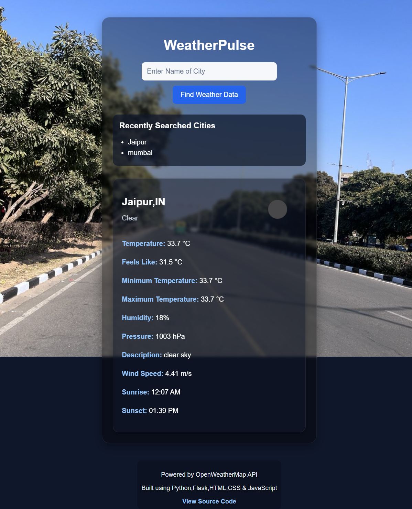
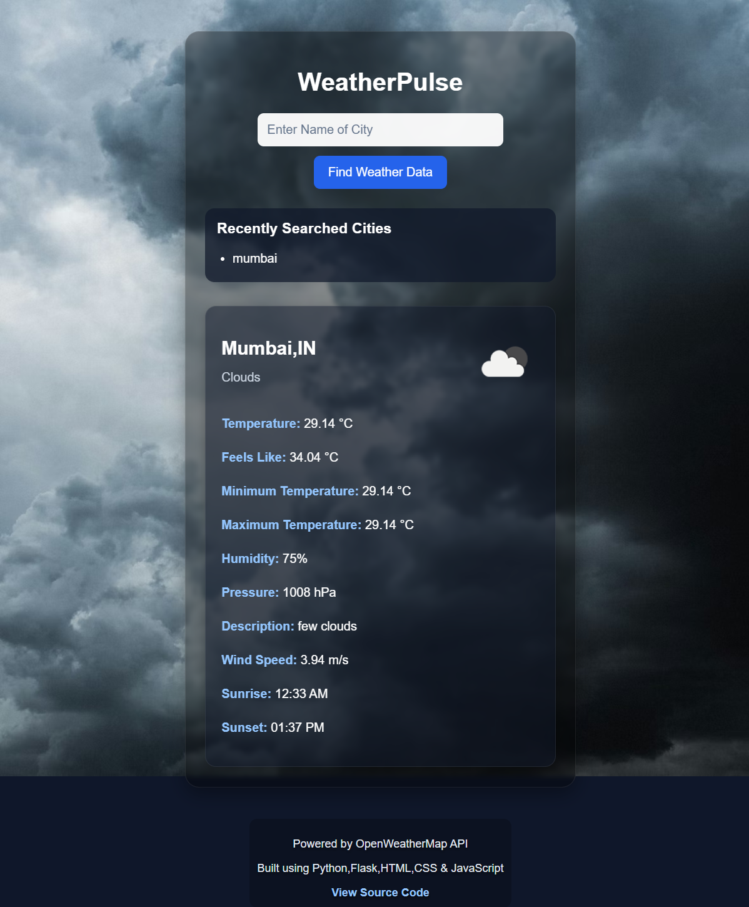

# WeatherPulse 🌦️
A real-time weather application with dynamic condition based backgrounds and responsive UI,built with Flask and integrated with the OpenWeatherMap API.Configured for production deployment using Gunicorn on Render.

🔗 **Live Demo:** https://weatherpulse-v8e3.onrender.com

---

## 📸 Preview

### ☀️ Clear Weather


### ☁️ Cloudy Weather


---

## ⚙️ Architecture & Technical Highlights
- Modular backend structure with dedicated `weather_service.py` for API logic,separated from Flask routes
- Configured for production deployment using Gunicorn on Render with secure environment variable management
- HTTP status validation and exception handling for clean,predictable error responses
- Flask sessions used for lightweight recent search tracking

---

## ✨ Features
- 🌈 **Dynamic backgrounds** : theme changes automatically for rain,snow,haze,clear,clouds and more
- ⚡ **Smart UX** : button disables on click with live "Wait,Fetching Data..." state before data loads
- 🌡️ **Full weather details** : temperature,min/max,humidity,wind speed,sunrise & sunset times
- 🕐 **Recently searched cities** : stored in Flask session for quick re-access
- 🛠️ **Graceful error handling** : clear messages for invalid city names and API failures
- 📱 **Responsive design** : works across desktop and mobile screen sizes

---

## 🛠️ Local Setup
```bash
git clone https://github.com/Piyushthecoderr/synent-task6-weatherapp-PriyanshuSharma
cd WeatherPulse
python -m venv venv
```
Activate virtual environment:

```bash
venv\Scripts\activate       # Windows
source venv/bin/activate    # Mac/Linux
```

Install dependencies:
```bash
pip install -r requirements.txt
```
Create a `.env` file in the root directory:

```env
API_KEY=your_openweathermap_api_key
SECURE_KEY=your_secret_key
```
Run the application:
```bash
python app.py
```
Open `http://127.0.0.1:5000`

---

## 🔮 Future Improvements
- 5-day weather forecast visualization using Chart.js
- Geolocation based weather detection
- City search autocomplete
- Animated weather effects
- Dark / light theme toggle